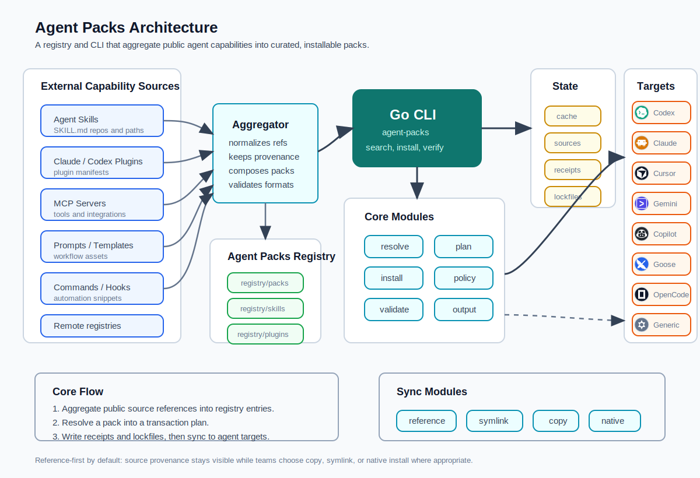

# Agent Packs

Curated, installable capability bundles for AI coding agents.

Agent Packs bundles public Skills, Plugins, MCP servers, commands, hooks, prompts,
templates, and composed packs into ready-to-use workflow packs.



Agent Packs aggregates capabilities from public skill repositories, Claude/Codex plugins,
MCP servers, prompts, templates, commands, hooks, and remote registries. The CLI
normalizes those sources into registry-backed packs, preserves provenance, writes
receipts and lockfiles, and syncs capabilities into supported coding agents through
reference, symlink, copy, or native install modes.

## Repository Layout

- `cli/`: Go CLI module and source.
- `registry/packs/`: Agent Pack manifests.
- `registry/skills/`: reusable Agent Skill source references.
- `registry/plugins/`: reusable Claude Code plugin source references.
- `registry/schemas/`: JSON Schema and example manifests.
- `docs/`: architecture notes.
- `tests/`: Python schema and CLI integration tests.

## Build

```sh
cd cli
go build -o bin/agent-packs ./cmd/agent-packs
```

## Install

Homebrew (after the first release is published):

```sh
brew install sandeshh/tap/agent-packs
```

Bootstrap installer:

```sh
curl -fsSL https://raw.githubusercontent.com/sandeshh/agent-packs/main/install.sh | sh
```

Or build locally from source (see Build above).

The release archive also includes a bundled `agent-packs` Codex skill. The
bootstrap installer copies it to `~/.codex/skills/agent-packs` by default so
agents can help users search, install, author, validate, and debug Agent Packs.
Set `AGENT_PACKS_INSTALL_SKILL=0` to skip this step or `AGENT_PACKS_SKILL_DIR`
to choose a different skill directory.

## CLI Usage

```sh
cli/bin/agent-packs search
cli/bin/agent-packs show frontend-engineer
cli/bin/agent-packs install frontend-engineer --target ./sandbox
cli/bin/agent-packs install frontend-engineer pr-review popular-engineering-skills --target ./sandbox
cli/bin/agent-packs install frontend-engineer --agent codex --only skills --dry-run
cli/bin/agent-packs init --agent codex --mode reference --scope project .
cli/bin/agent-packs version
```

Additional commands:

```sh
cli/bin/agent-packs search frontend --json
cli/bin/agent-packs show frontend-engineer --json
cli/bin/agent-packs audit frontend-engineer --json
cli/bin/agent-packs upgrade frontend-engineer pr-review --target ./sandbox
cli/bin/agent-packs rollback frontend-engineer pr-review --target ./sandbox
cli/bin/agent-packs tree eng-leader
cli/bin/agent-packs publish --check
cli/bin/agent-packs new pack platform-engineer --dir registry/packs
cli/bin/agent-packs registry add local /path/to/agent-packs
cli/bin/agent-packs install local/frontend-engineer --dry-run
cli/bin/agent-packs install eng-leader --target-tool codex --mode symlink --on-conflict backup --project .
cli/bin/agent-packs cache
cli/bin/agent-packs update --all
cli/bin/agent-packs outdated
cli/bin/agent-packs scan ~/.codex/skills
cli/bin/agent-packs import ~/.codex/skills
cli/bin/agent-packs lint eng-leader
cli/bin/agent-packs verify eng-leader
cli/bin/agent-packs resolve eng-leader
cli/bin/agent-packs policy check eng-leader policy.json
cli/bin/agent-packs licenses eng-leader
cli/bin/agent-packs attribution eng-leader
cli/bin/agent-packs index --output registry/index.json
cli/bin/agent-packs diff eng-leader
cli/bin/agent-packs compat eng-leader --agent codex
cli/bin/agent-packs cache prune
cli/bin/agent-packs list --target ./sandbox
cli/bin/agent-packs uninstall frontend-engineer pr-review --target ./sandbox
cli/bin/agent-packs doctor
cli/bin/agent-packs doctor targets
cli/bin/agent-packs validate registry/packs
cli/bin/agent-packs validate registry/skills
cli/bin/agent-packs validate registry/plugins
```

## Included Packs

- `frontend-engineer`: frontend implementation and browser verification workflows.
- `frontend-quality`: frontend UI engineering, browser verification, and performance checks.
- `pr-review`: code review and pull request inspection workflows.
- `eng-leader`: engineering leadership workflows for strategy, planning, quality, architecture decisions, delivery, launch readiness, security, and performance. Several skills reference Addy Osmani's public `addyosmani/agent-skills` repository via upstream source metadata.
- `product-discovery`: interview, idea refinement, spec writing, and task breakdown workflows.
- `implementation-core`: context engineering, source-grounded development, API design, incremental implementation, and TDD workflows.
- `reliability-debugging`: debugging, adversarial review, test hardening, and security hardening workflows.
- `shipping-ops`: git workflow, CI/CD, launch readiness, migrations, and ADR/documentation workflows.
- `full-lifecycle-engineer`: composed lifecycle pack from discovery through implementation, review, release, and follow-up.
- `popular-engineering-skills`: broadly useful public engineering skills selected from high-visibility lifecycle skill repositories.
- `popular-claude-dev-plugins`: common Claude Code development plugins from Anthropic's official plugin directory.
- `popular-integration-plugins`: common Claude Code integration plugins for GitHub, GitLab, Playwright, Context7, Linear, Firebase, Terraform, and semantic code tooling.
- `popular-agent-starter`: a composed starter bundle combining popular engineering skills and Claude Code development plugins.

The `popular-*` packs use public proxies for adoption because most skill/plugin
ecosystems do not publish install counts. Selection signals include official or
curated marketplace presence, repository popularity, broad workflow coverage, and
common agentic coding use cases.

## Tool Target Matrix

Agent Packs knows common global and project skill directories for supported coding tools. Use `agent-packs doctor targets` to inspect the matrix. Install with `--agent <tool>` or `--target-tool <tool>`. Project installs use the tool's project skill directory, for example Codex project installs target `.agents/skills`.

Supported tools include `codex`, `claude`, `cursor`, `gemini`, `copilot`, `goose`, `opencode`, and `generic`. Common aliases such as `claude-code` map to `claude`.

## Project Configuration

Initialize a project config with defaults for agent, sync mode, and install scope:

```sh
cli/bin/agent-packs init --agent codex --mode reference --scope project .
```

This writes `.agent-packs.yaml` in the project directory.

## Installation Model

Agent Packs orchestrates native install flows instead of replacing them.

- Pack-level `skills` and `plugins` entries are source references. They are recorded in plans, receipts, and lockfiles, but are not copied into the target.
- `source` is the location or command the installer resolves. Prefer pinned commit refs for reproducibility.
- Optional `upstreamSource` is only for attribution/provenance when `source` is not enough.
- Registry skills point at remote sources with `metadata.agentpacks.source`.
- Registry plugins reference their `repository` or `homepage` when available; otherwise they reference their registry directory.
- Inline local skill capabilities can still be copied into the selected agent skill target when a pack explicitly declares them under `capabilities`.
- Inline remote skill capabilities can still be fetched with `git` when the source is a Git URL or a GitHub `/tree/<branch>/<path>` URL.
- Sync modes are explicit: `reference` records sources only, `symlink` links materialized skills, `copy` copies skills, and `native` enables native plugin planning.
- Conflicts are controlled with `--on-conflict skip|overwrite|backup`.
- Inline plugin commands are preview-safe by default and only run with `--execute-plugins`.
- Lifecycle commands accept multiple pack IDs directly: `install`, `upgrade`, `rollback`, and `uninstall` run packs sequentially and fail fast on the first error.
- Installed packs write receipts under `<target>/receipts/`.
- Installed packs write lockfiles under `<target>/packs/<pack-id>/agent-pack.lock`.
- `uninstall` removes installed inline skill folders and receipts; referenced plugins are reported for native/manual cleanup.

## Lifecycle Commands

Agent Packs supports a basic package-manager lifecycle:

- `cache`: shows and creates central source/cache/lock/registry directories under the Agent Packs home.
- `update --all`: refreshes configured registries.
- `outdated`: lists installed packs with pack-version drift and capability revision drift (`--json` supported).
- `install <pack...>`: installs one or more packs with shared target, agent, mode, conflict, and plugin execution settings.
- `upgrade <pack...>`: re-installs one or more packs using each pack's prior receipt settings.
- `rollback <pack...>`: restores one or more previous receipt-backed install states when history exists.
- `uninstall <pack...>`: removes one or more installed packs, including installed inline skill folders and receipts.
- `audit <pack>`: supply-chain SBOM report (`--json` supported).
- `version`: prints CLI version (`--json` supported).
- `init [dir]`: writes `.agent-packs.yaml` project defaults.
- `new pack|skill|plugin <id>`: scaffolds valid starter manifests.
- `tree <pack>` / `deps <pack>`: shows composed packs, referenced capabilities, sources, and trust.
- `publish --check`: runs contributor checks before opening a registry PR.
- `scan [path]`: discovers existing `SKILL.md` files.
- `import <skills-dir>`: copies discovered skills into `<target>/sources/imported/`.
- `lint <pack>`: validates pack metadata.
- `verify <pack>`: expands a pack, checks duplicate/missing capability sources, and warns about moving remote refs.
- `resolve <pack>`: classifies sources as local, GitHub tree, pinned, or moving refs.
- `policy check <pack> <policy.json>`: enforces allow/deny source rules, pinned refs, and native-command policy.
- `licenses <pack>` and `attribution <pack>`: report license and source attribution.
- `index [--output path]`: generates a searchable registry index.
- `diff <pack>`: compares the installed lockfile with the current registry pack.
- `compat <pack> --agent <tool>`: checks tool compatibility metadata.
- `cache prune|clean`: removes cached state; `clean` also removes imported sources.

## Remote Registries

Registries are named sources stored in `<target>/registries.json`.

```sh
cli/bin/agent-packs registry add official https://github.com/sandeshh/agent-packs --target ~/.agent-packs
cli/bin/agent-packs registry list --target ~/.agent-packs
cli/bin/agent-packs install official/frontend-engineer --target ~/.agent-packs
cli/bin/agent-packs registry remove official --target ~/.agent-packs
```

A registry source can be a local repository path or a Git URL. Remote registries are cloned into `<target>/registries/<name>/` and resolved from either `registry/packs/` or `packs/`.

## Specifying Plugins And Skills

Plugins and skills are declared as entries in `capabilities`. Plugin entries must include `format` and `install` metadata so an installer can resolve the marketplace/package/command. Skill entries must include `format` and `entry` so an installer can locate the `SKILL.md` file. Any capability can include optional `upstreamSource` when separate provenance metadata is useful.

```json
{
  "type": "plugin",
  "name": "Anthropic Claude Code code-review plugin",
  "source": "https://github.com/anthropics/claude-plugins-official/tree/main/plugins/code-review",
  "format": "anthropic-plugin",
  "entry": ".claude-plugin/plugin.json",
  "requiresExecution": true,
  "trust": "official",
  "install": {
    "method": "claude-marketplace",
    "marketplace": "claude-plugins-official",
    "package": "code-review",
    "command": "claude plugin install code-review@claude-plugins-official"
  }
}
```

```json
{
  "type": "skill",
  "name": "Microsoft Azure Agent Skills",
  "source": "https://github.com/MicrosoftDocs/Agent-Skills/tree/main/skills",
  "format": "agent-skill",
  "entry": "SKILL.md",
  "targets": [".claude/skills/", ".codex/skills/", ".github/skills/"]
}
```

## Pack Composition

Packs can include other packs with the `packs` field. They can also include reusable source references with `skills` and `plugins`. `skills` and `plugins` entries can be registry ID strings or objects with their own remote `source`. Included packs and referenced capabilities are expanded before install.

```json
{
  "id": "review-combo",
  "name": "Review Combo Pack",
  "version": "0.1.0",
  "description": "Composes review-oriented packs.",
  "packs": ["pr-review"],
  "skills": [
    "frontend-implementation-guidance",
    {
      "id": "remote-planning-skill",
      "source": "https://github.com/addyosmani/agent-skills/tree/main/skills/planning-and-task-breakdown",
      "format": "agent-skill",
      "entry": "SKILL.md"
    }
  ],
  "plugins": [
    "browser-verification-workflow",
    {
      "id": "remote-code-review-plugin",
      "source": "https://github.com/anthropics/claude-plugins-official/tree/main/plugins/code-review",
      "format": "anthropic-plugin",
      "entry": ".claude-plugin/plugin.json"
    }
  ]
}
```

Reusable skills live as Agent Skills at `registry/skills/<id>/SKILL.md`. Reusable plugins live as Claude Code plugins at `registry/plugins/<id>/.claude-plugin/plugin.json`. A pack can reference them by ID, or bypass local registry entries by using object refs with remote `source` URLs. The CLI treats both forms as references rather than installable copies.

Agent Skills follow the Agent Skills specification: a skill directory with required `SKILL.md` frontmatter fields `name` and `description`. Claude Code plugins follow the plugin manifest layout with `.claude-plugin/plugin.json` and a required `name` field. Use `metadata.agentpacks.source` on registry skills and `repository` or `homepage` on registry plugins to point at the remote source.

Registry entries can include catalog metadata such as `maintainers`, `stability`,
`lastVerified`, `reviewStatus`, `deprecated`, `replacement`, and `requirements`.
These fields power registry search, publish checks, and the static catalog.

## Examples

Example manifests live in `registry/schemas/examples/`:

- `minimal-pack.json`: the smallest valid pack manifest.
- `full-pack.json`: a complete manifest showing every supported capability type.
- `real-world-pack.json`: examples based on public Claude Code plugin and Agent Skills repositories.
- `composed-pack.json`: a pack that includes another pack.
- `referenced-capabilities-pack.json`: a pack that includes reusable `skills` and `plugins` entries.

## Tests

```sh
cd cli && go test ./...
python3 -m unittest discover -s tests
```

## Core Concepts

- Pack: a curated bundle for a role, stack, workflow, or task.
- Categories/tools/scope: searchable facets for registry discovery and install intent.
- Skill: an instruction module, often `SKILL.md`.
- Plugin: a packaged agent extension, such as an Anthropic/Claude Code plugin.
- Tool: MCP server, shell command, API connector, or executable integration.
- Recipe: recommended combinations of packs for a larger use case.

## License

Apache-2.0
